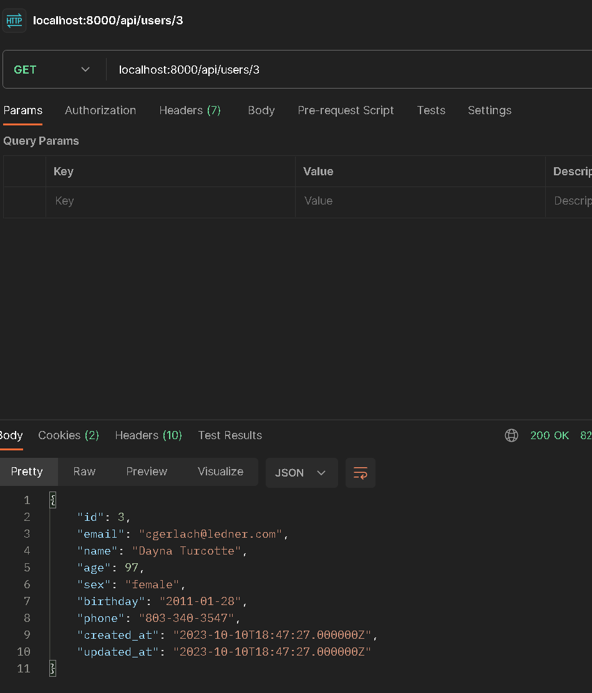

# laravel-crud-rest-api-test-task

### Задание: [Тестовое задание на должность “программист PHP”.pdf](%D2%E5%F1%F2%EE%E2%EE%E5%20%E7%E0%E4%E0%ED%E8%E5%20%ED%E0%20%E4%EE%EB%E6%ED%EE%F1%F2%FC%20%93%EF%F0%EE%E3%F0%E0%EC%EC%E8%F1%F2%20PHP%94.pdf)

## Preview 

``
Stack: Laravel, pgsql
``

## Инструкция По Запуску:


+ ``` Clone the repo```


+ ``` cd laravel-crud-rest-api-test-task```


+ ```cp .env.example .env```


+ ```docker-compose up --build -d```


+ ```docker-compose run --rm -it app composer install```


+ ```docker-compose run --rm -it app php artisan migrate --seed```

#### Сервер доступен на 8000 порту

